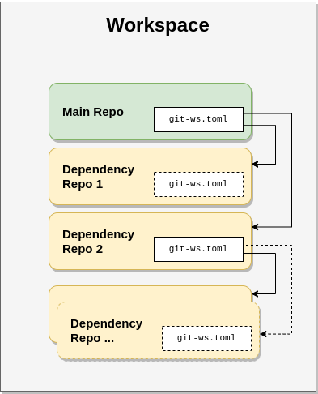

# Multi Repository Management Tool

AnyRepo is a lightweight tool for creating and managing *workspaces* consisting of several interdependent `git` repositories. Starting from a *main repository*, AnyRepo discovers dependencies specified in a *manifest file*, fetching any specified required repositories and assembling them into a single workspace.



👉 You can read more about the used nomenclature in the [documentation](./docs/manual/nomenclature.rst).


# Installation

AnyRepo is written in Python and - as usual - installing it is pretty easy:

```bash
pip install anyrepo
```

And that's it! Ideally, if your project also uses Python, we recommend adding AnyRepo as a dependency to it as well, so that you can track the exact version of it together with your other dependencies. For example, if you use `poetry`, add it by running

```bash
# Add AnyRepo as development dependency:
poetry add --group dev anyrepo
```

# Usage

AnyRepo comes with a command line client called `anyrepo` - this is what you will be using most of the time.

Let's assume we have a project called `myapp`, which requires a library `mylib` that is maintained in another `git` repository. In order to use this project with AnyRepo, `myapp` needs to provide a so called *manifest*. An AnyRepo manifest is a simple [TOML](https://toml.io/) file - by default called `anyrepo.toml` in the project's root folder - which defines the dependencies a project has as well as some other meta information. A minimal manifest for our project could look like this:

```toml
[[dependencies]]
name = "mylib"
url = "git@github.com:example/mylib.git"
revision = "v2.3.4"
```

If `myapp` and `mylib` are stored on the same server (side-by-side), than the manifest can even be simpler:

```toml
[[dependencies]]
name = "mylib"
revision = "v2.3.4"
```

The project will be searched via a relative path (which is either `../mylib` or `../mylib.git` depending on the main repository's URL). Relative paths are in general useful as they allow to use the same protocol for the main repository as well as any of its dependencies.

To build a workspace from a project prepared like that, simply clone it via `anyrepo`:

```bash
cd $HOME/Projects
mkdir my_app_workspace
cd my_app_workspace
anyrepo clone git@github.com:example/myapp.git
```

This will clone the app repository and also the library side-by-side:

```bash
ls -a
# Should print something like
# . .. .anyrepo myapp mylib
```

As you can see, besides the two repositories we wanted, there is also a hidden `.anyrepo` folder where the tool stores the needed configuration data.

Sometimes there are use cases where using `anyrepo clone` cannot be used. For example, when a CI/CD system creates the initial clone of the main repository, you may need a way to fetch the remaining projects. This can be done by simply running the following within the main project:

```bash
anyrepo init
```

Another important use case is keeping a workspace up-to-date. Lets say you pull in an update in the main repository, which in turn might cause changes in the manifest to be pulled in as well. Updating the existing workspace is as simple as

```bash
# Get changes, e.g. by pulling in from the remote:
git pull

# Update the workspace:
anyrepo update

# Alternatively, run `git rebase` instead of `git pull` in dependencies:
anyrepo update --rebase
```

AnyRepo also comes with some handy tools to run `git` operations on all the repositories in the workspace. For example:

```bash
# Run a `git pull` on all repos:
anyrepo pull

# Or a `git fetch`:
anyrepo fetch

# Or a `rebase`:
anyrepo rebase
```

These are basically wrapper commands around the generic `anyrepo foreach` command, which allows to run any kind of command in each repository:

```bash
# Run `git status` in each repository:
anyrepo foreach -- git status
```

## Alternatives

Before writing AnyRepo, we investigates several other existing tools in the hope they would fulfil out needs. In particular, we looked into the following tools and methodologies which are widely used to organize large projects:

- [`git submodules`](https://git-scm.com/book/en/v2/Git-Tools-Submodules).
- Google's [repo](https://gerrit.googlesource.com/git-repo/) tool.
- The [`west`](https://docs.zephyrproject.org/latest/develop/west/index.html) tool developed in the scope of [Zephyr](https://www.zephyrproject.org/).
- Leaving the pure `git` domain, one can also use a package manager like [`conan`](https://conan.io/).
- And lastly, there are also approaches to still pack everything into a large so called *monorepo*.

Unfortunately, none of the tools we tested really satisfied us. But hey, as we are developers - *why not starting our own tool for the purpose?*

And that's what we did - AnyRepo is a our tool for managing a large workspace consisting of several smaller `git` projects. Here is how it compares to the other tools we evaluated:


|                           | `git submodules` | `repo` | `west` | *Monorepos* | *AnyRepo* |
| ------------------------- | ---------------- | ------ | ------ | ----------- | --------- |
| Reusable Components       | ✅               | ✅     | ✅     | ➖          | ✅        |
| Ease of Use               | ➖               | ✅     | ✅     | ✅          | ✅        |
| Editable Components       | ➖               | ✅     | ➖     | ✅          | ✅        |
| Freezing Configurations   | ✅               | ✅     | ✅     | ✅          | ✅        |
| Transitive Dependencies   | ➖               | ➖     | ✅     | ➖          | ✅        |
| Relative Dependency Paths | ✅               | ✅     | ➖     | ➖          | ✅        |

👉 Please note that our view on the various features might be biased. As we did, always look at all the options available to you before deciding for one tool or the other. While the other tools in comparison did not model what we needed for our workflow, they might just be what you are looking for.

If you want to learn more, have a look into the [documentation](./docs/manual/why.rst).

