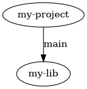

Command Line Interface
======================

The command line interface is the main interface used when working with a Git Workspace managed project. It can be used via the ``git-ws`` executable, but the most convenient way is using the ``git ws`` command.

Basics
------

Like with many other tools, ``git ws`` works with sub-commands, i.e. the first argument is usually the name of a sub-command to run. Also as with other tools, you can usually get quick help on the command line by calling the tool (or any of it's sub-commands) with the ``--help`` flag. Calling e.g. ``git ws --help`` will produce the following output:

.. include:: ../static/cli.txt
    :code: bash

In the following, the various commands available are explained in detail.

.. _git_ws_clone:

``git ws clone``
----------------

TODO: new cloning scheme

Clone a Git Workspace managed project and prepare the workspace folder.

.. include:: ../static/cli.clone.txt
    :code: bash

This is one of the two basic commands which can be used to initialize a workspace for an existing project. If you have a suitable project on a server and aim to create a new workspace from it, you would run something like this:

.. code-block:: bash

    cd Projects
    mkdir my-workspace
    cd my-workspace
    git ws clone https://example.com/my-project

.. note::
    You will need to run ``git ws update`` to also fetch dependencies. Alternatively, you can use the ``--update`` option of the clone command to run the update right away.

The clone operation can be customized using some additional options:

- By default, the file ``git-ws.toml`` in the main project will be used to start searching for dependencies. The ``--manifest`` option can be used to override this and point to another file (relative to main project's root folder).
- The ``--group-filter`` option can be used to fine tune the dependencies that are included (or excluded). Read more about this in :ref:`group_filtering`.
- The ``--update`` option can be used to run the :ref:`git_ws_update` command right away during the clone operation.

.. warning::
    The default way of operation for Git Workspace is to put all ``git`` clones side-by-side. For this reason, if, during the clone operation, any other file or folder is detected within the workspace folder, the operation will stop. You can use the ``--force`` option to still continue in this case.

.. _git_ws_init:

``git ws init``
---------------

Prepare a workspace folder from an existing ``git`` clone.

.. include:: ../static/cli.init.txt
    :code: bash

This command is pretty similar to the :ref:`git_ws_clone` command, except that it operates on an existing ``git`` clone. Typically, it is used like this:

.. code-block:: bash

    cd Projects
    mkdir my-workspace
    cd my-workspace
    git clone https://example.com/my-project
    cd my-project
    git ws init

Typically, using ``git ws clone`` is a bit shorter and more concise. In fact, the both share most of their options (so refer to :ref:`git_ws_clone` to learn more about possible tweaks). The main use case of ``git ws init`` is when e.g. a CI/CD system already cloned the main project and the workspace needs to be initialized from that existing clone.

.. _git_ws_update:

``git ws update``
-----------------

Fetch dependencies and check them out at the revision specified in the manifest.

.. include:: ../static/cli.update.txt
    :code: bash

The ``git ws update`` command is used to actually create a workspace and keep it up-to-date. After initializing a workspace using :ref:`git_ws_init` or :ref:`git_ws_clone`, use this command to clone also all dependencies and check them out at the revision specified in the project's manifest file:

.. code-block:: bash

    cd Projects
    mkdir my-workspace
    cd my-workspace
    git ws clone https://example.com/my-project
    git ws update

.. note::

    Instead of using two different commands, you can also use the ``--update`` option to run the ``init/clone`` and ``update`` commands in one go.

Another use case is keeping a workspace up-to-date. For example, after getting changes for the main project, the revision for some of the included dependencies might have changed. In this case, ``update`` can be used to change to the newly specified revision:

.. code-block:: bash

    cd Projects/my-workspace/my-project/
    git pull
    git ws update

There are also some additional options which can be used to further tweak the command:

- You can use the ``--project`` option to specify which project to operate on. This option can be used multiple times. Unless otherwise specified, the command operates on all projects in a workspace. Using this option, the update can be limited to the given projects only.
- As with the ``clone`` and ``init`` commands, you can specify an alternative manifest using the ``--manifest`` option. The operation can be further limited using the ``--group-filter`` filter. See :ref:`group_filtering` for more information.
- By default, the update will also pull changes from the server, including the main project. If this is not desired, pulling the main repository can be avoided by using the ``--skip-main`` option.
- If preferred, one can use the ``--rebase`` option to run a ``git rebase`` instead of a ``git pull``.
- By using ``--prune``, ``git`` repositories that became outdated will be removed from the workspace.

.. _git_ws_deinit:

``git ws deinit``
-----------------

De-initialize a workspace.

.. include:: ../static/cli.deinit.txt
    :code: bash

This command is used to remove any Git Workspace related information from a workspace folder. Basically this will remove the ``.git-ws`` folder and hence any kind of workspace settings. This can be useful if the workspace folder is going to be reused:

.. code-block:: bash

    cd Projects/my-workspace
    git ws deinit
    # Note the use of the --force option:
    git ws init ./another-project --force

.. _git_ws_foreach:

``git ws foreach``
------------------

Run a command once for every ``git`` clone in a workspace.

.. include:: ../static/cli.foreach.txt
    :code: bash

This command is useful to run a shell command once for each ``git`` clone in a workspace. For example, the following would run a ``git status`` in all clones:

.. code-block:: bash

    git ws foreach git status

- The command can be fine tuned similarly to the :ref:`git_ws_update` command using the ``--project``, ``--manifest`` and ``--group-filter`` options.
- By default, the projects are traversed from the main project down to its dependencies. By using the ``--reverse`` option, the order in which the projects are visited are inverted.

.. _git_ws_git:

``git ws git``
--------------

Run a ``git`` command for all clones within a workspace.

.. include:: ../static/cli.git.txt
    :code: bash

This is similar to the :ref:`git_ws_foreach`, but automatically calls ``git``. It is basically a shorthand for ``git ws foreach git``.

.. code-block:: bash

    # Run a git status in all projects:
    git ws git status

    # This is the equivalent for:
    git ws foreach git status

.. _git_ws_pull:

``git ws pull``
---------------

Run a ``git pull`` in all clones within a workspace.

.. include:: ../static/cli.pull.txt
    :code: bash

.. _git_ws_push:

``git ws push``
---------------

Run a ``git push`` in all clones within a workspace.

.. include:: ../static/cli.push.txt
    :code: bash

.. _git_ws_rebase:

``git ws rebase``
-----------------

Run a ``git rebase`` in all clones within a workspace.

.. include:: ../static/cli.rebase.txt
    :code: bash

.. _git_ws_fetch:

``git ws fetch``
----------------

Run a ``git fetch`` in all clones within a workspace.

.. include:: ../static/cli.fetch.txt
    :code: bash

.. _git_ws_diff:

``git ws diff``
---------------

Run a ``git diff`` in all clones within a workspace.

.. include:: ../static/cli.diff.txt
    :code: bash

.. _git_ws_checkout:

``git ws checkout``
-------------------

Check out all projects to the revision specified in the manifest.

.. include:: ../static/cli.checkout.txt
    :code: bash

This command can be used to check out all dependencies to the revision which has been specified in the manifest file. This can be useful if some repositories have been manually checked out to other revisions, as the command will ensure all repositories are on their well defined version.

.. code-block:: bash

    cd Projects/my-workspace

    # Switch some repository to a new branch:
    cd some-dependency
    git switch -c my-branch

    # Now restore the state of the workspace:
    git ws checkout

.. warning::

    If no revision has been specified for some dependencies, this command will not change these dependencies, even if they are checked out on a revision other than the default branch.

.. _git_ws_status:

``git ws status``
-----------------

Show repository status of all projects within a workspace.

.. include:: ../static/cli.status.txt
    :code: bash

This is similar to running ``git ws git status``, but the file paths shown will be modified such that they can be used with commands such as :ref:`git_ws_add`, :ref:`git_ws_reset` and :ref:`git_ws_commit`.

.. _git_ws_add:

``git ws add``
--------------

Run a ``git add`` on the specified paths.

.. include:: ../static/cli.add.txt
    :code: bash

This command can be used to conveniently add files to the index for later commit. It is mostly useful if there are modifications in multiple repositories. So instead of the following:

.. code-block:: bash

    cd Projects/my-workspace

    # Change into one project first:
    cd some-project
    git add ./some-file.txt

    # Change into another project and stage more files:
    cd ../another-project
    git add ./another-file.txt

The following can be used:

.. code-block:: bash

    cd Projects/my-workspace

    git ws add ./some-project/some-file.txt ./another-project/another-file.txt

Use :ref:`git_ws_status` to display all changes using paths suitable for use with this command.

.. _git_ws_reset:

``git ws reset``
----------------

Run a ``git reset`` on the given paths.

.. include:: ../static/cli.reset.txt
    :code: bash

Similarly to the :ref:`git_ws_add` command, this allows conveniently running a ``git reset`` on files spread across repositories in a workspace. So instead of this:

.. code-block:: bash

    cd Projects/my-workspace

    # Change into one project first:
    cd some-project
    git reset ./some-file.txt

    # Change into another project and stage more files:
    cd ../another-project
    git reset ./another-file.txt

This can be used:

.. code-block:: bash

    cd Projects/my-workspace

    git ws reset ./some-project/some-file.txt ./another-project/another-file.txt

Use :ref:`git_ws_status` to display all changes using paths suitable for use with this command.

.. _git_ws_commit:

``git ws commit``
-----------------

Runs a ``git commit`` in the projects within a workspace.

.. include:: ../static/cli.commit.txt
    :code: bash

This command can be used in two ways (similar to the use of ``git commit`` itself). In the first form, when no file paths are specified, the command runs a commit in all repositories which have staged changes:

.. code-block:: bash

    git ws commit -m "A commit in all repos with stages changes"

For staging, use either ``git add`` or ``git ws add``.

In the second form, a ``git commit`` will be run in the repositories where the given files are stored:

.. code-block:: bash

    cd Projects/my-workspace

    git ws commit \
        ./some-project/some-file.txt ./another-project/another-file.txt \
        -m "A commit in two projects"

In this form, only the files given on the command line will be included in the commits.

.. _git_ws_info:

``git ws info``
---------------

Retrieve information about the workspace.

.. include:: ../static/cli.info.txt
    :code: bash

This command has further sub-commands which can be used to get information about the workspace. In particular, these commands are the following:

.. _git_ws_info_dep_tree:

``git ws info dep-tree``
++++++++++++++++++++++++

Show the dependency tree of the project.

.. include:: ../static/cli.info.dep-tree.txt
    :code: bash

This command can be useful to show the dependency tree for an existing project. By default, the tree structure is printed out like this:

.. code-block:: bash

    my-project
    └── my-lib (revision='main')

Using the ``--dot`` option, the command generates output that can be fed into the `Graphviz <https://graphviz.org/>`_ tools such as ``dot``:

.. code-block:: bash

    git ws info dep-tree --dot
    ## Should print something like
    # digraph tree {
    #     "my-project";
    #     "my-lib";
    #     "my-project" -> "my-lib" [label="main"];
    # }

Running it through ``dot`` would generate a graph like this:

.. _git_ws_info_main_path:

``git ws info main-path``
+++++++++++++++++++++++++

Get the path to the main project within a workspace.

.. include:: ../static/cli.info.main-path.txt
    :code: bash

This command simply prints the path to the main project for the current workspace:

.. code-block:: bash

    git ws info main-path
    ## Should print something like
    # /home/User/Projects/my_workspace/my_project

.. _git_ws_info_project_paths:

``git ws info project-paths``
+++++++++++++++++++++++++++++

Show the paths to all projects within a workspace.

.. include:: ../static/cli.info.project-paths.txt
    :code: bash

This command prints the list of paths to all projects within a workspace. For example:

.. code-block:: bash

    git ws info project-paths
    ## Should print something like
    # /home/User/Projects/my_workspace/my_project
    # /home/User/Projects/my_workspace/my_lib1
    # /home/User/Projects/my_workspace/my_lib2

.. warning::

    If all you want is to iterate over all projects and run some actions on then, consider using
    :ref:`git_ws_foreach` instead.

.. _git_ws_info_workspace_path:

``git ws info workspace-path``
++++++++++++++++++++++++++++++

Show the path to the workspace folder.

.. include:: ../static/cli.info.workspace-path.txt
    :code: bash

This command simply prints the path to the workspace folder like that:

.. code-block:: bash

    git ws info workspace-path
    ## Should print something like
    # /home/User/Projects/my_workspace

.. _git_ws_config:

``git ws config``
-----------------

Get and set application configuration options.

.. include:: ../static/cli.config.txt
    :code: bash

The ``config`` sub-command can be used to retrieve and modify configuration values for the system wide, per user and workspace configuration.

Configuration values can be stored in three locations:

- System wide configuration applies to all users on a given system.
- User configuration applies to the current user.
- Finally, workspace configuration applies only to the current workspace.

The values from these locations are merged (in the given order), i.e. the system configuration has the lowest priority and can be overridden by the user configuration which in turn can be overridden by the workspace configuration.

In addition to persistently set options in these configuration files, options also can be overridden by setting appropriate environment options. For example, to override the ``color_ui`` option, one can set the environment variable ``GIT_WS_COLOR_UI``.

To interact with the configuration, a set of sub-commands are available. By default, these commands either operate on the merged configuration options or (in case of commands that modify configurations) on the configuration files from highest to lowest priority (i.e. if one runs such a command from within a workspace, the workspace configuration file is modified, otherwise, the user configuration file is written). This can be changed by using the options ``--system``, ``--user`` or ``--workspace`` to read from or write to a specific file.

.. _git_ws_config_delete:

``git ws config delete``
++++++++++++++++++++++++

Delete an option.

.. include:: ../static/cli.config.delete.txt
    :code: bash

This deletes the given option from the configuration such that the implicit default will be used instead:

.. code-block:: bash

    # Delete the color_ui option:
    git ws config delete color_ui

.. _git_ws_config_files:

``git ws config files``
+++++++++++++++++++++++

Get the location of the configuration files.

.. include:: ../static/cli.config.files.txt
    :code: bash

This prints the locations of the configuration files. The location of these files are system dependent, so this command is useful to learn where to put configuration files on a concrete system:

.. code-block:: bash

    git ws config files
    ## Should print something like:
    # system: /etc/xdg/GitWS/config.toml
    # user: /home/User/.config/GitWS/config.toml
    # workspace: /home/User/Projects/my-workspace/.git-ws/config.toml

.. _git_ws_config_get:

``git ws config get``
+++++++++++++++++++++

Read a single configuration option.

.. include:: ../static/cli.config.get.txt
    :code: bash

This reads and prints the value of the given configuration option.

.. code-block:: bash

    git ws config get color_ui
    ## Should print e.g.:
    # True

.. _git_ws_config_list:

``git ws config list``
++++++++++++++++++++++

Read all configuration values.

.. include:: ../static/cli.config.list.txt
    :code: bash

This reads and prints all configuration options, including a short description
for each option:

.. code-block:: bash

    git ws config list
    ## Should print something like:
    # # The path (relative to the project's root folder) to the manifest file.
    # manifest_path = git-ws.toml
    #
    # # If set to true, the output the tool generates will be colored.
    # color_ui = True
    #
    # # The groups to operate on.
    # groups

.. _git_ws_config_set:

``git ws config set``
+++++++++++++++++++++

Set a configuration option.

.. include:: ../static/cli.config.set.txt
    :code: bash

This command sets the given option to the specified value. By default, if an unknown option is given, the command terminates with an error. Using the ``--ignore-unknown`` option, writing any option can be enforced.

.. code-block:: bash

    # Setting a standard option:
    git ws config set color_ui True

    ## Setting a custom option requires a special flag:
    git ws config set --ignore-unknown my_option "Hello world!"

.. _git_ws_manifest:

``git ws manifest``
-------------------

Work with manifest files.

.. include:: ../static/cli.manifest.txt
    :code: bash

Git Workspace extensively uses manifest files to store meta information and manage dependencies. The ``git ws manifest`` command allows working with these manifest files, creating them and play other tricks needed in the daily workflow.

.. _git_ws_manifest_create:

``git ws manifest create``
++++++++++++++++++++++++++

Create a new manifest.

.. include:: ../static/cli.manifest.create.txt
    :code: bash

This command generates a new manifest file. The generated file comes with a lot of built-in documentation, hence, editing the file should be quite easy. Refer to :ref:`manifest_manual` to learn more about the general structure of the manifest file.

.. code-block:: bash

    # Generate a new manifest and write it to file git-ws.toml
    git ws manifest create

    # Create a new manifest, writing it to my-custom-manifest.toml
    git ws manifest create --manifest my-custom-manifest.toml

.. _git_ws_manifest_freeze:

``git ws manifest freeze``
++++++++++++++++++++++++++

Freeze a project.

.. include:: ../static/cli.manifest.freeze.txt
    :code: bash

This command is useful to create a *frozen* state of a project. Often, projects will pull in dependencies on branches or tags. However, when creating a tag on the main project, it is desired to also record the specific versions that are used at that point in time. This is exactly what the ``freeze`` command does. It creates a new manifest from the current one but fixes each dependency on its specific ``git`` commit hash. Also transitive dependencies are recorded.

.. code-block:: bash

    # Create a frozen manifest and write it to standard output:
    git ws manifest freeze

    # Create a frozen manifest but write it to a file:
    git ws manifest freeze --output git-ws-v2.3.4.toml

To create a release of a project, one would first create a frozen manifest, check it into the main project and then finally create a tag in the main project:

.. code-block:: bash

    # The version we want to create:
    VERSION=1.2.3

    # Create the manifest:
    git ws manifest freeze --output git-ws-v$VERSION.toml

    # Commit the manifest:
    git commit -m "Add v$VERSION manifest" git-ws-v$VERSION.toml

    # Create a tag:
    git tag -m "Project release v$VERSION" v$VERSION

To recreate a historic state of the project, one can use the ``--manifest`` option of the various ``git ws`` commands to use the alternative, frozen manifest, e.g.:

.. code-block:: bash

    # Clone a project and build a workspace using a frozen manifest:
    git ws clone https://example.com/my-project --manifest git-ws-v1.2.3.toml

.. _git_ws_manifest_path:

``git ws manifest path``
++++++++++++++++++++++++

Print the path to the main manifest:

.. include:: ../static/cli.manifest.path.txt
    :code: bash

This command prints the path to the manifest of the main project.

.. code-block:: bash

    git ws manifest path
    ## Should print something like:
    # /home/User/Projects/my_workspace/my_project/git-ws.toml

.. _git_ws_manifest_paths:

``git ws manifest paths``
+++++++++++++++++++++++++

Print the paths of all manifest files (i.e. the main project and all, also transitive, dependencies).

.. include:: ../static/cli.manifest.paths.txt
    :code: bash

This commands prints the paths to the main manifest file as well as any manifest files of dependencies:

.. code-block:: bash

    git ws manifest paths
    ## Should print something like
    # /home/User/Projects/my_workspace/my_project/git-ws.toml
    # /home/User/Projects/my_workspace/my_lib1/git-ws.toml
    # /home/User/Projects/my_workspace/my_lib2/git-ws.toml

.. _git_ws_manifest_resolve:

``git ws manifest resolve``
+++++++++++++++++++++++++++

Create a merged manifest.

.. include:: ../static/cli.manifest.resolve.txt
    :code: bash

This command creates a new manifest from the current one, merging all the dependencies such that everything is contained stand-alone in one file.

.. code-block:: bash

    # Create a resolved manifest, writing it to standard output:
    git ws manifest resolve

    # Same, but write to a file:
    git ws manifest resolve --output git-ws-resolved.toml

Such a resolved manifest can be useful to understand the layout of the created workspace. In addition, it can be used to quickly create a tweaked workspace as it allows to easily point (transitive) dependencies to another revision.

.. _git_ws_manifest_upgrade:

``git ws manifest upgrade``
+++++++++++++++++++++++++++

Upgrade an existing manifest.

.. include:: ../static/cli.manifest.upgrade.txt
    :code: bash

This command reads an existing manifest file and updates it to the latest version, i.e. newly existing options (including documentation) will be added.

.. code-block:: bash

    git ws manifest upgrade

Any user specific values are kept as-is, however, comments are stripped from the file.

.. _git_ws_manifest_validate:

``git ws manifest validate``
++++++++++++++++++++++++++++

Validate a manifest file.

.. include:: ../static/cli.manifest.validate.txt
    :code: bash

This command reads and validates a manifest file. If the file is valid, the command exits with an exit code of ``0``. In case the file is not valid, the error is printed and the command exits with an error code.

.. code-block:: bash

    # Validate a file:
    git ws manifest validate

    ## In case an error occurs, something like this might get printed:
    # Error: Manifest 'my_project/git-ws.toml' is broken: 1 validation error for ManifestSpec
    # dependencies -> 0 -> groups
    #   value is not a valid tuple (type=type_error.tuple)
