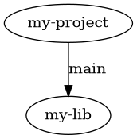

.. _command_line_interface_group_workspace_management:

Workspace Management
====================

The following group of commands is used to create and modify :ref:`workspaces <nomenclature_workspace>`.

.. _git_ws_clone:

``git ws clone``
----------------

Clone a Git Workspace managed project and prepare the workspace folder.

.. literalinclude:: ../../static/cli.clone.txt
   :language: text

This is one of the two basic commands which can be used to initialize a workspace for an existing project. If you have a suitable project on a server and aim to create a new workspace from it, you would run something like this:

.. code-block:: bash

    cd Projects
    git ws clone https://example.com/my-project

This will:

* Create a sub-directory called ``my-project``.
* Clone and checkout the specified project as a sub-folder into that one (i.e. into ``my-project/my-project``).

.. note::
    You will need to run ``git ws update`` to also fetch dependencies. Alternatively, you can use the ``--update`` option of the clone command to run the update right away.

The clone operation can be customized using some additional options:

- By default, the file ``git-ws.toml`` in the main project will be used to start searching for dependencies. The ``--manifest`` option can be used to override this and point to another file (relative to main project's root folder).
- The ``--group-filter`` option can be used to fine tune the dependencies that are included (or excluded). Read more about this in :ref:`group_filtering`.
- The ``--update`` option can be used to run the :ref:`git_ws_update` command right away during the clone operation.
- If desired, you can specify a path to a folder to be used as workspace folder.

.. warning::
    The default way of operation for Git Workspace is to put all ``git`` clones side-by-side. For this reason, if, during the clone operation, any other file or folder is detected within the workspace folder, the operation will stop. You can use the ``--force`` option to still continue in this case.

.. _git_ws_init:

``git ws init``
---------------

Prepare a workspace folder from an existing ``git`` clone.

.. literalinclude:: ../../static/cli.init.txt
   :language: text

This command is pretty similar to the :ref:`git_ws_clone` command, except that it operates on an existing ``git`` clone. Typically, it is used like this:

.. code-block:: bash

    cd Projects
    mkdir my-workspace
    cd my-workspace
    git clone https://example.com/my-project
    cd my-project
    git ws init

Typically, using ``git ws clone`` is a bit shorter and more concise. In fact, the both share most of their options (so refer to :ref:`git_ws_clone` to learn more about possible tweaks). The main use case of ``git ws init`` is when e.g. a CI/CD system already cloned the main project and the workspace needs to be initialized from that existing clone.

.. _git_ws_update:

``git ws update``
-----------------

Fetch dependencies and check them out at the revision specified in the manifest.

.. literalinclude:: ../../static/cli.update.txt
   :language: text

The ``git ws update`` command is used to actually create a workspace and keep it up-to-date. After initializing a workspace using :ref:`git_ws_init` or :ref:`git_ws_clone`, use this command to clone also all dependencies and check them out at the revision specified in the project's manifest file:

.. code-block:: bash

    cd Projects
    git ws clone https://example.com/my-project
    cd my-project
    git ws update

.. note::

    Instead of using two different commands, you can also use the ``--update`` option to run the ``init/clone`` and ``update`` commands in one go.

Another use case is keeping a workspace up-to-date. For example, after getting changes for the main project, the revision for some of the included dependencies might have changed. In this case, ``update`` can be used to change to the newly specified revision:

.. code-block:: bash

    cd Projects/my-project/my-project/
    git pull
    git ws update

There are also some additional options which can be used to further tweak the command:

- You can use the ``--project`` option to specify which project to operate on. This option can be used multiple times. Unless otherwise specified, the command operates on all projects in a workspace. Using this option, the update can be limited to the given projects only.
- As with the ``clone`` and ``init`` commands, you can specify an alternative manifest using the ``--manifest`` option. The operation can be further limited using the ``--group-filter`` filter. See :ref:`group_filtering` for more information.
- By default, the update will also pull changes from the server, including the main project. If this is not desired, pulling the main repository can be avoided by using the ``--skip-main`` option.
- If preferred, one can use the ``--rebase`` option to run a ``git rebase`` instead of a ``git pull``.
- By using ``--prune``, ``git`` clones that became obsolete (i.e. because they are no longer referenced as a dependency) will be removed from the workspace.
- ``--prune`` checks obsolete clones to be empty. If the clone contains untracked files, uncommitted changes, unpushed commits or stashed changes, the prune operation will fail. Use ``--force`` to disable this check.

.. _git_ws_deinit:

``git ws deinit``
-----------------

De-initialize a workspace.

.. literalinclude:: ../../static/cli.deinit.txt
   :language: text

This command is used to remove any Git Workspace related information from a workspace folder. Basically this will remove the ``.git-ws`` folder and hence any kind of workspace settings. This can be useful if the workspace folder is going to be reused:

.. code-block:: bash

    cd Projects/my-project
    git ws deinit
    # Note the use of the --force option:
    git ws init ./another-project --force

In this example, we remove the workspace settings which were based on the former main project and then re-initialize the workspace pointing the ``init`` command to one of the former dependencies (making it the new main project). Note that we have to use the ``--force`` option as otherwise ``git ws`` would stop with a warning that there already are some folders (other than the main project) in the workspace folder.

.. _git_ws_info:

``git ws info``
---------------

Retrieve information about the workspace.

.. literalinclude:: ../../static/cli.info.txt
   :language: text

This command has further sub-commands which can be used to get information about the workspace. In particular, these commands are the following:

.. _git_ws_info_dep_tree:

``git ws info dep-tree``
++++++++++++++++++++++++

Show the dependency tree of the project.

.. literalinclude:: ../../static/cli.info.dep-tree.txt
   :language: text

This command can be useful to show the dependency tree for an existing project. By default, the tree structure is printed out like this:

.. code-block:: bash

    my-project
    └── my-lib (revision='main')

Using the ``--dot`` option, the command generates output that can be fed into the `Graphviz <https://graphviz.org/>`_ tools such as ``dot``:

.. code-block:: bash

    git ws info dep-tree --dot
    ## Should print something like
    # digraph tree {
    #     "my-project";
    #     "my-lib";
    #     "my-project" -> "my-lib" [label="main"];
    # }

Running it through ``dot`` would generate a graph like this:

.. _git_ws_info_main_path:

``git ws info main-path``
+++++++++++++++++++++++++

Get the path to the main project within a workspace.

.. literalinclude:: ../../static/cli.info.main-path.txt
   :language: text

This command simply prints the path to the main project for the current workspace:

.. code-block:: bash

    git ws info main-path
    ## Should print something like
    # /home/User/Projects/my_workspace/my_project

.. _git_ws_info_project_paths:

``git ws info project-paths``
+++++++++++++++++++++++++++++

Show the paths to all projects within a workspace.

.. literalinclude:: ../../static/cli.info.project-paths.txt
   :language: text

This command prints the list of paths to all projects within a workspace. For example:

.. code-block:: bash

    git ws info project-paths
    ## Should print something like
    # /home/User/Projects/my_workspace/my_project
    # /home/User/Projects/my_workspace/my_lib1
    # /home/User/Projects/my_workspace/my_lib2

.. warning::

    If all you want is to iterate over all projects and run some actions on then, consider using
    :ref:`git_ws_foreach` instead.

.. _git_ws_info_workspace_path:

``git ws info workspace-path``
++++++++++++++++++++++++++++++

Show the path to the workspace folder.

.. literalinclude:: ../../static/cli.info.workspace-path.txt
   :language: text

This command simply prints the path to the workspace folder like that:

.. code-block:: bash

    git ws info workspace-path
    ## Should print something like
    # /home/User/Projects/my_workspace

