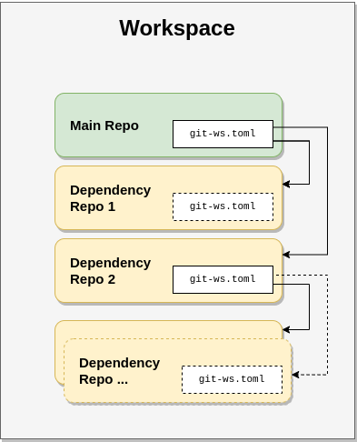

Nomenclature
============

Before we go into the depths of Git Workspace, let's talk about wording. In this chapter, we'll list all of the things we work with to ensure everyone is on the same page.

.. _nomenclature_workspace:

Workspace
---------

A workspace is a collection of one or more ``git`` repositories. Typically, a workspace consists of one top level ``workspace folder`` which in turn contains the various ``git`` repositories in a flat layout (i.e. all clones are stored side-by-side as siblings, although technically Git Workspace also supports nested storage).

Git Workspace will also create a folder called ``.git-ws`` within the workspace folder where additional information and workspace configuration are stored.

``git ws`` provides several :ref:`commands <command_line_interface_group_workspace_management>` that can be used to create and modify workspaces.

.. _nomenclature_main_project:

Main Project
------------

Each workspace has exactly one *main project* which is a clone of a ``git`` repository. The main project is the one from where dependency resolution starts, i.e. Git Workspace collects the dependencies of the main project. If the dependencies in turn have (nested) dependencies, these also will be added to the workspace.

.. _nomenclature_dependencies:

Dependencies
------------

*Dependencies* are clones of ``git`` repositories that are needed by the main project, either directly or as a transitive dependency of one of the direct ones of the main project. By default, they are stored side-by-side next to the main project within the workspace folder.

.. _nomenclature_manifest:

Manifest
--------

The manifest is a file (typically called ``git-ws.toml``) stored within a project which describes a project. The main purpose of the manifest is to declare dependencies of a project.

.. _nomenclature_workspace_information:

Workspace Information
---------------------

Git Workspace stores some meta data about the workspace within the ``.git-ws`` folder in the workspace folder. This kind of information is absolutely necessary in order to work with the workspace. For example, the path to the main project is stored there. The :ref:`git_ws_info` command can be used to query such information.

.. _nomenclature_application_configuration:

Application Configuration
-------------------------

Some of the aspects of Git Workspace can be tuned. Such aspects are stored as application configuration. Configuration can be set persistently system wide, for the current user, for a specific workspace or it can be (dynamically) overridden using environment variables. The :ref:`git_ws_config` command can be used to read and write configuration information.
